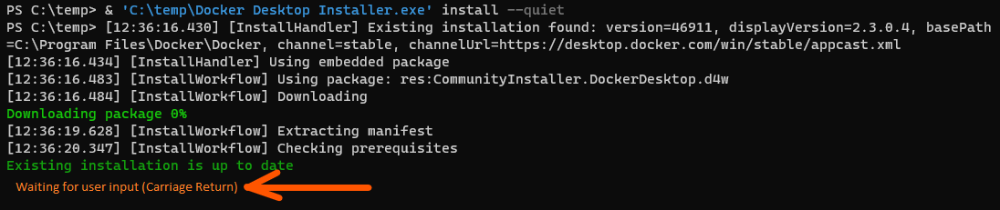
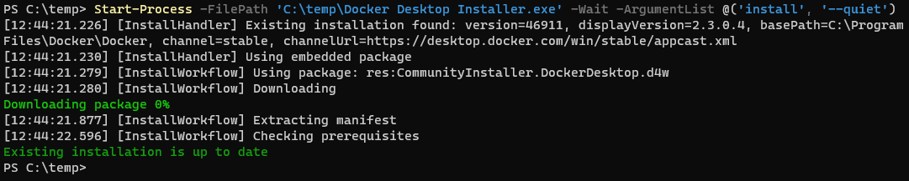

# Docker Desktop Installer Wrapper - Windows 10

From the command line the Docker Desktop Installer waits for a user to hit return after the installation completes.  Wrapping
this command in ```Start-Process``` allows it to run to completion without blocking for user-input (which is ideal for automated installations).

**Waiting for User Input**


***Not*** **Waiting for User Input**

